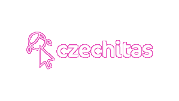

# Úvod do programování
_Materiály vycházejí z webu https://kodim.cz/kurzy/uvod-do-progr-1._ 

## Co potřebuješ?

* Nainstalovaný Python
* Nainstalovaný editor kódu VS Code. 

Na webu najdeš [návod na instalaci](https://kodim.cz/kurzy/uvod-do-progr-1/priprava/jazyky-nastroje/instalace-python). 

Nepovedla se ti instalace? Zkus psát kód [do online editoru](https://www.online-python.com). 

---

## Co nás čeká?
| Kapitola | Teorie | Kód | Cvičení | Řešení cvičení |
|---|---|---|---|---|
| 2 Čísla a řetězce | [[materiály](https://kodim.cz/kurzy/uvod-do-progr-1/prvni-krucky/cisla-retezce/python-konzole)] | [[kód](2-cisla-a-retezce.ipynb)] | [[zadání](https://kodim.cz/kurzy/uvod-do-progr-1/prvni-krucky/cisla-retezce/excs)] | [[řešení](reseni-cviceni/2-cisla-retezce)]|
| 3 Proměnné | [[materiály](https://kodim.cz/kurzy/uvod-do-progr-1/prvni-krucky/promenne/jmena-promennych)] | [[kód](3-promenne.ipynb)] | [[zadání](https://kodim.cz/kurzy/uvod-do-progr-1/prvni-krucky/promenne/excs)]  [[nudíš se?](https://kodim.cz/kurzy/uvod-do-progr-1/prvni-krucky/promenne/extra-excs)] |  [[řešení](reseni-cviceni/3-promenne)] |
| 4 Funkce a moduly | [[materiály](https://kodim.cz/kurzy/uvod-do-progr-1/prvni-krucky/funkce-moduly/funkce)] | [[kód](4-funkce-moduly.ipynb)] | [[zadání](https://kodim.cz/kurzy/uvod-do-progr-1/prvni-krucky/funkce-moduly/excs)]  [[nudíš se?](https://kodim.cz/kurzy/uvod-do-progr-1/prvni-krucky/funkce-moduly/cteni-na-doma)] |  [[řešení](reseni-cviceni/4-funkce-moduly)] |
| 5 Vstup a výstup | [[materiály](https://kodim.cz/kurzy/uvod-do-progr-1/prvni-krucky/vstup-vystup/vystup-do-terminalu)] |  [[kód](5-vstup-vystup.ipynb)] | [[zadání](https://kodim.cz/kurzy/uvod-do-progr-1/prvni-krucky/vstup-vystup/excs)]  [[nudíš se?](https://kodim.cz/kurzy/uvod-do-progr-1/prvni-krucky/vstup-vystup/cteni-na-doma)] | [[řešení](reseni-cviceni/5-vstup-vystup)] |
| 6 Podmínky | [[materiály](https://kodim.cz/kurzy/uvod-do-progr-1/prvni-krucky/podminky/bloky)] | [[kód](6-podminky.ipynb)] | [[zadání](https://kodim.cz/kurzy/uvod-do-progr-1/prvni-krucky/podminky/excs)]  [[nudíš se?](https://kodim.cz/kurzy/uvod-do-progr-1/prvni-krucky/podminky/cteni-na-doma)] | [[řešení](reseni-cviceni/6-podminky)]  |
| 7 Sekvenční hodnoty | [[materiály](https://kodim.cz/kurzy/uvod-do-progr-1/prvni-krucky/sekvence/retezce)] | [[kód](7-sekvencni-hodnoty.ipynb)] | [[zadání](https://kodim.cz/kurzy/uvod-do-progr-1/prvni-krucky/sekvence/excs)] | [[řešení](reseni-cviceni/7-sekvencni-hodnoty)]  |
| 8 Cykly | [[materiály](https://kodim.cz/kurzy/uvod-do-progr-1/prvni-krucky/cykly/cyklus-for)] |  [[kód](8-cykly.ipynb)] | [[zadání](https://kodim.cz/kurzy/uvod-do-progr-1/prvni-krucky/cykly/excs)] | [[řešení](reseni-cviceni/8-cykly)]  |

---
## Kam dál?
* https://www.czechitas.cz/tema/programovani
* https://pyladies.cz
* https://python.cz/zacatecnici/
* https://www.w3schools.com/python/default.asp
* https://docs.python.org/3/

<!-- 
 -->
  
<!-- 
 -->
